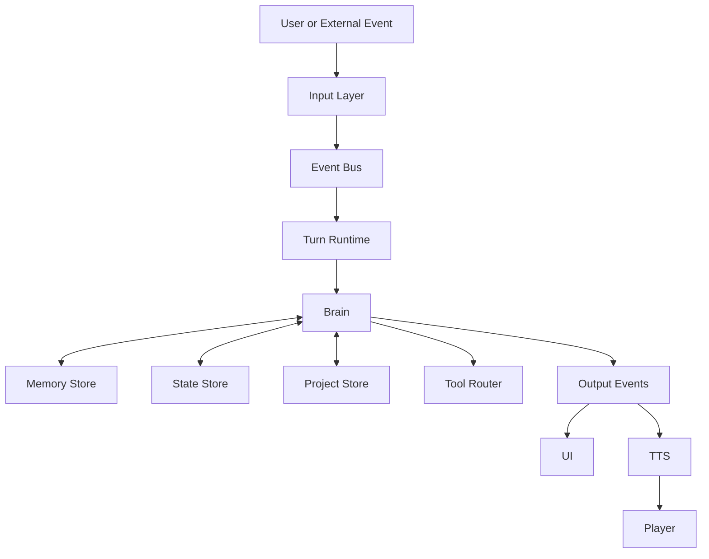
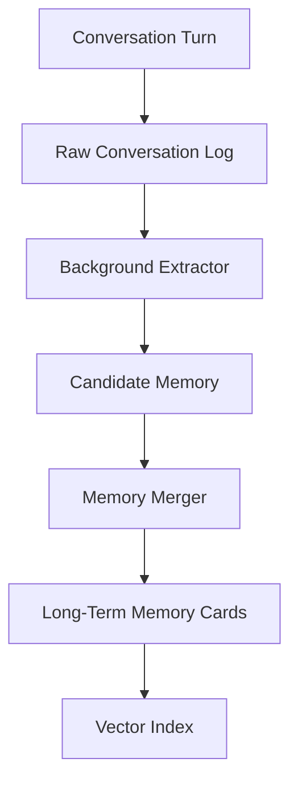
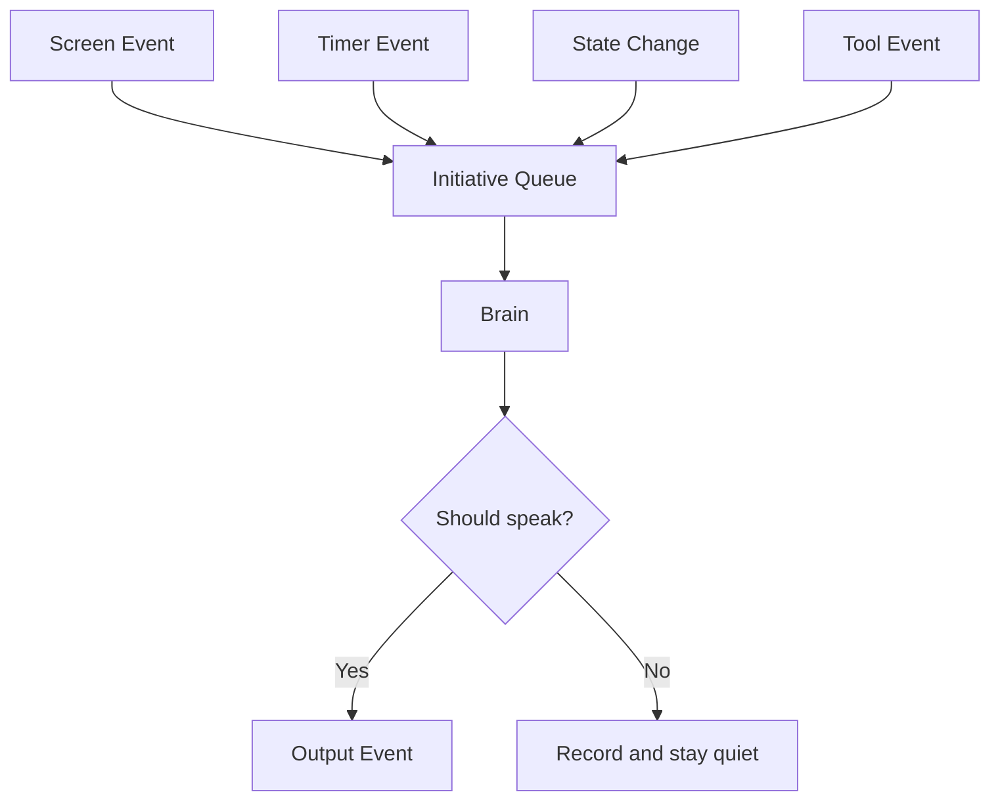

# Companion AI Architecture Constitution

Version: 1.0
Status: Foundational

## Mission

This project is a long-term companion AI, not a character chat platform.

Core values:

- Long-term memory
- Long-term companionship
- Proactive interaction
- Project assistance
- Natural voice and text interaction
- Continuous growth

Non-goals:

- Character marketplace
- Multi-character simulation
- Digital human showcase platform

## Core Principles

1. Single Brain

   The system has exactly one decision center: `Brain`. Memory, state,
   character, and project modules store data. They do not make autonomous
   decisions.

2. Event-driven system

   Inputs become events. Outputs are events. Modules communicate through the
   event bus rather than direct cross-module calls whenever a boundary is
   crossed.

3. State and intelligence are separate

   `Brain` reads and updates state. State modules never decide what to do.

4. Memory must not block conversation

   Raw conversation logging may be synchronous and cheap. Extraction,
   compression, merging, and indexing run in the background.

5. Fixed context budget

   Conversation history may grow forever, but prompt size must stay bounded.
   Only selected memory enters the prompt.

6. Extensions must not pollute the core

   Live2D, desktop pets, browser control, MCP, automation, and future tools
   attach as plugins or execution adapters.

## Module Classes

- Input sources: voice, keyboard, screen, timer, plugins. They produce events.
- State layer: memory, state, character, project. They store data.
- Brain layer: the only reasoning and decision center.
- Execution layer: TTS, UI, player, tools, notifications. They execute commands.

## Top-Level Flow

`AgentLoop` only collects input. It must not directly orchestrate ASR, LLM, TTS,
memory, and playback. A single user-visible interaction goes through
`TurnRuntime`, which returns a normalized `TurnResult`.

Current transitional shape:

- Text turn: `AgentLoop -> TurnRuntime -> ChatPipeline -> Brain`
- Voice turn: `AgentLoop -> TurnRuntime -> Orchestrator`

Target shape:

- Text turn: `AgentLoop -> TurnRuntime -> Brain`
- Voice turn: `AgentLoop -> TurnRuntime -> ASR Adapter -> Brain -> TTS Adapter -> Player`

The transitional shape is allowed only while preserving the current working
voice streaming path.

## Memory Flow

The vector index is only an index. It is not the source of truth.

## Initiative Flow

## Feature Gate

Every new feature must answer:

1. Is it state, event, decision, or execution?
2. Does it create another Brain? If yes, redesign.
3. Does it make the prompt grow over time? If yes, redesign.
4. Can it be implemented as a plugin? If yes, keep the core unchanged.
