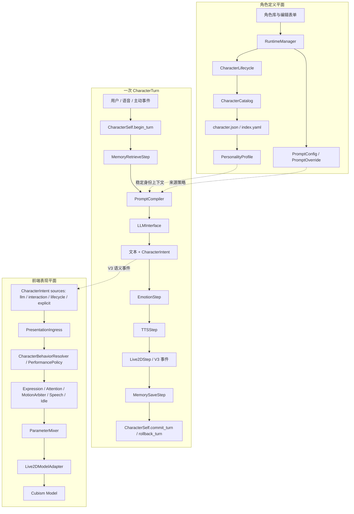
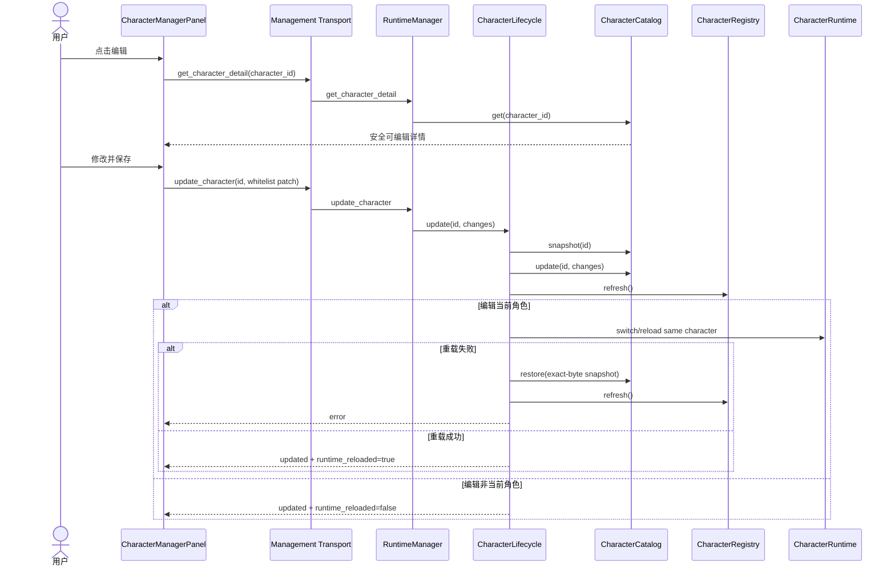
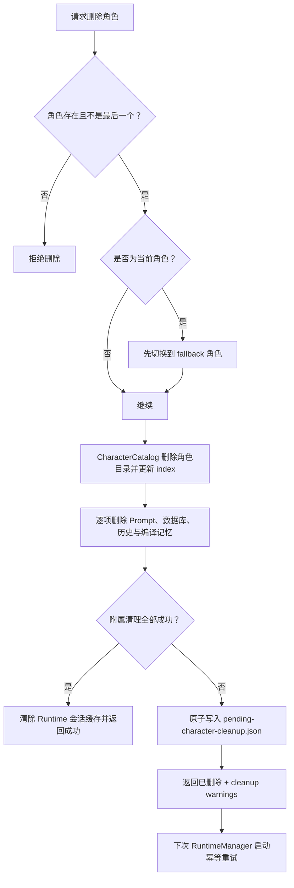
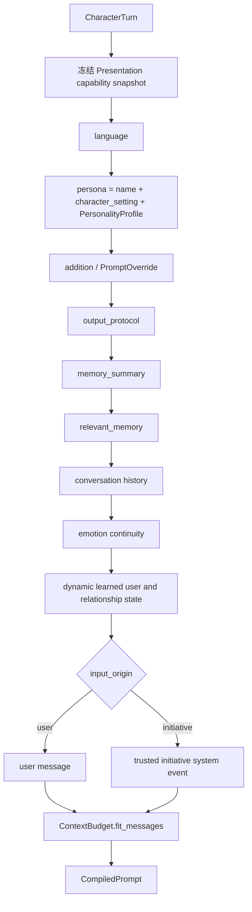
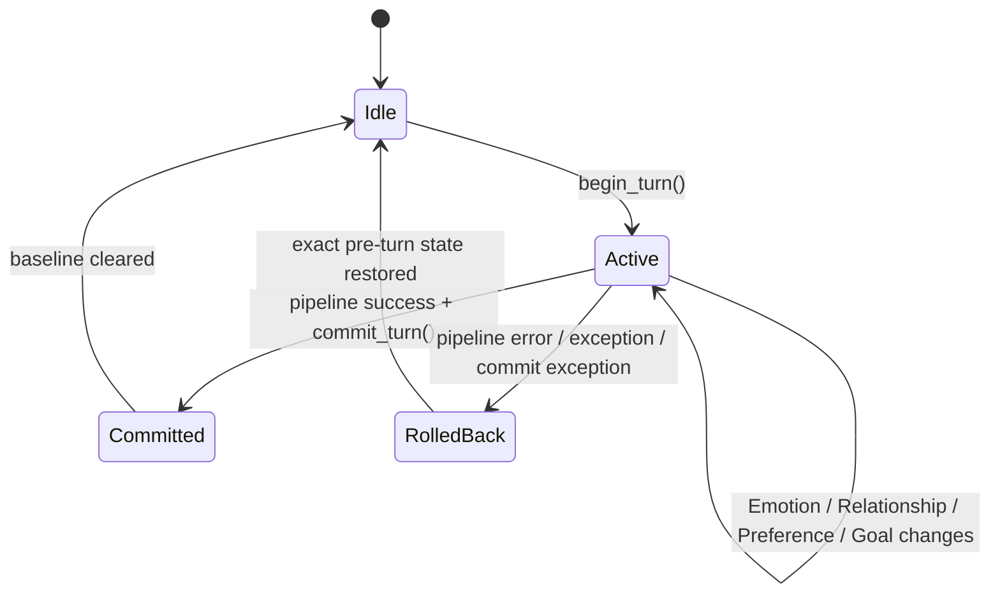
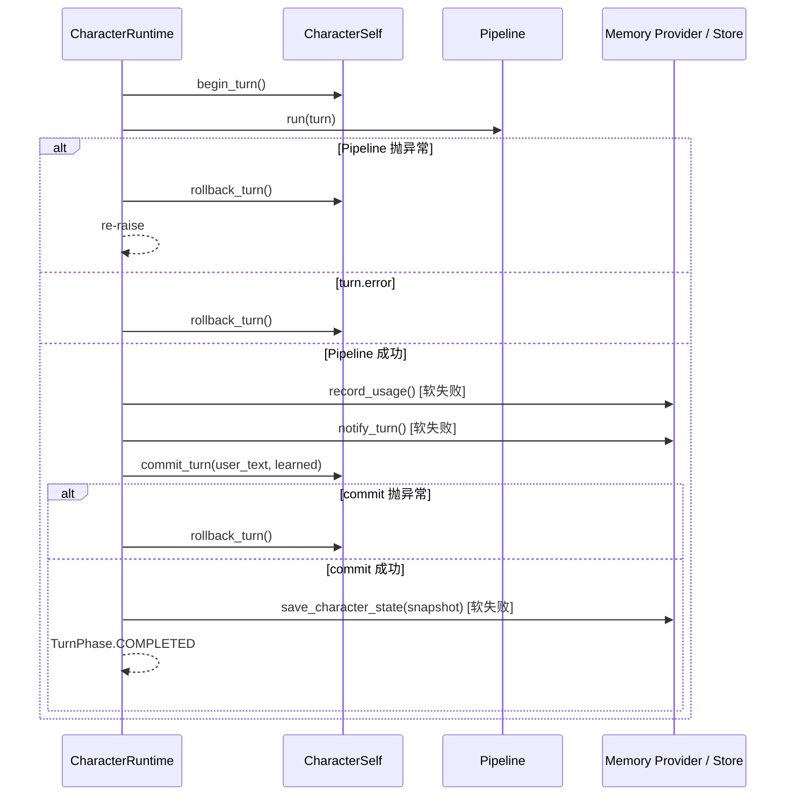
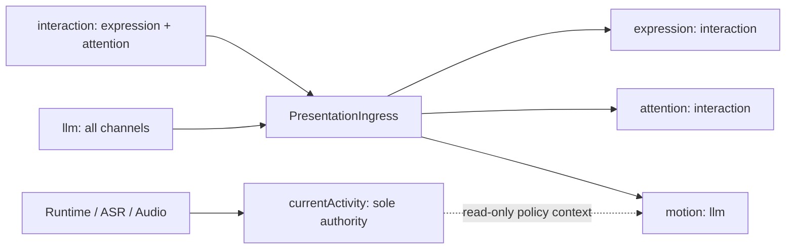
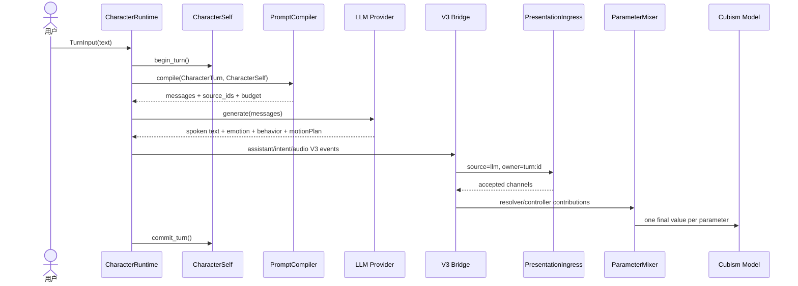

# 角色人格、提示词、状态与 Live2D 表现编排架构基线

> **状态：** 当前架构基线
> **基线日期：** 2026-08-15
> **实现提交：** `d801d89 feat: unify character personality and presentation orchestration`
> **实现分支：** `codex/character-card-editing-20260815`
> **改造前存档：** `codex/archive-persona-baseline-20260815` → `bda1bfe`
> **适用范围：** 角色卡、结构化人格、角色创建/编辑/删除、Prompt 装配、角色动态状态、记忆提交、LLM 语义表现与前端 Live2D 控制入口。

本文是上述范围的权威对齐文档。历史 `plans/`、`specs/`、审计和交接材料用于解释决策来源，不再代表当前实现；发生冲突时，按以下顺序判断：

1. 当前代码与配置；
2. 当前自动测试和真实运行证据；
3. 本文；
4. 历史计划、审计和交接文档。

本文不替代 `docs/runtime/V3_PROTOCOL.md`、`docs/runtime/LAUNCH_ARCHITECTURE.md` 或模型资产说明。它只负责把“角色是谁、系统如何理解她、状态如何变化、LLM 如何表达、Live2D 如何执行”这条跨层链路讲清楚。

---

## 1. 本次改造最终解决了什么

改造前的问题不是单个 Prompt 写得不好，也不是尾巴、表情或动作参数中的某一个值不对，而是多个层级的职责混在一起：

- 角色卡只有长文本人格，缺少稳定、可编辑、可校验的结构化人格；
- 角色可以创建和删除，但编辑链路不完整；
- 轻量引用型角色和完整导入型角色的资源语义没有在编辑接口上明确区分；
- Prompt 装配曾分散在 Planner、Compiler、管理预览和角色覆盖规则中；
- 情绪、心境、关系、偏好和记忆可能从不同位置落盘，缺少一次 turn 的提交边界；
- 前端自然状态、LLM、点击交互和生命周期事件都可能直接触发表情或动作；
- Live2D 最终参数链虽然已经统一，但在语义入口层仍可能互相争抢；
- pytest 依赖系统 `%TEMP%`，Windows 临时目录权限异常会把大量测试变成 fixture `ERROR`。

本次改造建立了五个深模块和一条明确的最终执行链：

1. `PersonalityProfile`：角色自身的稳定结构化人格；
2. `CharacterLifecycle`：角色创建、编辑、删除、刷新和回滚的协调模块；
3. `PromptCompiler`：唯一生产 Prompt 装配与预算模块；
4. `CharacterSelf`：一次 turn 内角色动态状态的提交/回滚模块；
5. `PresentationIngress`：所有语义表现请求进入 Live2D 控制链前的统一仲裁模块；
6. `CharacterBehaviorResolver → ParameterMixer → Live2DModelAdapter → Cubism`：唯一最终参数写入链。

一句话概括：

> 角色卡决定“她长期是谁”，记忆和 `CharacterSelf` 决定“她此刻经历了什么”，`PromptCompiler` 决定“本轮给 LLM 看什么”，LLM 只输出语义意图，`PresentationIngress` 决定“现在谁能表现什么”，最后由既有 Mixer 单写入链驱动模型。

---

## 2. 从原计划到最终实现

### 2.1 本轮执行计划及完成状态

| 阶段 | 原计划目标 | 最终结果 | 当前证据 |
|---|---|---|---|
| 1. 基线与存档 | 冻结改造前状态，确保可回退 | 已完成 | 存档分支 `codex/archive-persona-baseline-20260815`，提交 `bda1bfe` |
| 2. 冻结改动面 | 先理清人格、角色、Prompt、状态、Live2D 关系 | 已完成 | 变更集中在 29 个实现/测试文件，未改 TTS/ASR/模型资产 |
| 3. 人格与角色生命周期 | 增加结构化人格，闭合角色编辑和安全删除 | 已完成 | `PersonalityProfile`、`CharacterLifecycle`、角色编辑 UI 和回滚测试 |
| 4. Prompt 收口 | 去除重复生产装配链，保留来源策略和预算 | 已完成 | `PromptCompiler` 为生产装配入口，`DefaultPlanner` 仅为兼容外壳 |
| 5. 状态事务 | 一轮对话只提交一次角色状态，失败回滚 | 已完成 | `begin_turn/commit_turn/rollback_turn` 与软失败告警 |
| 6. Live2D 入口协调 | 所有调用 `applyIntent` 的 LLM、交互、生命周期和显式语义来源统一仲裁 | 已完成 | `PresentationIngress` 的 source/channel/lease 仲裁；连续 idle 仍由既有低权重参数贡献链处理 |
| 7. 统一验收 | 自动测试、构建、真实浏览器和服务关停 | 已完成 | Python、Node、TypeScript、Vite、真实 LLM→Live2D 和完整关停证据 |
| 8. 独立复核与提交 | 残链扫描、精确暂存、提交 | 已完成 | 提交 `d801d89` |

### 2.2 吸收了哪些历史计划

#### 人格与记忆闭环计划

保留并落实的核心思想：

- SQLite 仍是记忆和动态角色状态的持久化事实源；
- 稳定人格、当前状态、用户事实、关系变化必须分层；
- Prompt 使用软预算装配，而不是无限堆叠上下文；
- 一轮结束后再形成可持久化结果。

本次修正：

- 不再把“人格”泛化成所有角色相关数据；
- 角色自身喜好放在 `personality_profile.self_preferences`；
- 从用户话语中学习到的用户喜好仍属于记忆和动态状态；
- 不新增一次“人格分析 LLM 调用”，避免延迟、失败点和无响应概率上升。

#### Prompt 来源控制计划

保留并落实：

- 每个静态 Prompt 来源继续支持 `default / replace / disabled`；
- 角色卡人格与角色级 Prompt override 继续分层；
- Prompt 预览和真实请求共用同一编译模块；
- `_source_id` 保留来源身份，用于管理界面和审计。

本次修正：

- 不再由管理面板、Planner、DecisionStep 各自拼一套 Prompt；
- 角色卡编辑不会偷偷清除用户设置的 `replace` 覆盖；
- UI 明确提示：存在 persona `replace` 时，角色卡人格修改不会覆盖该规则。

#### Live2D 自然表现与融合计划

保留并落实：

- 继续使用单一 `ParameterMixer → Live2DModelAdapter → Cubism` 写入链；
- LLM 只能输出 emotion、behavior、attention、energy、naturalVAD 和安全 motionPlan；
- 模型参数差异继续集中在 `AvatarCapabilityProfile` 和逻辑参数映射中；
- 原生动作、程序化动作、唇同步、表情和视线仍由既有控制模块执行。

本次新增的关键补口：

- 在所有语义表现来源和既有控制器之间增加 `PresentationIngress`；
- 仲裁发生在“想表现什么”这一层，而不是等到 Cubism 参数已经互相打架后再补优先级；
- 支持按 expression、motion、attention 三个语义通道部分接纳请求；真实 activity 由 Runtime/音频状态机单独维护。

### 2.3 明确没有采用的方向

- 没有完整替换为 Soullink 第二套运行时；
- 没有引入第二个 Live2D 参数播放器或第二条 SDK 写入链；
- 没有让 LLM 直接输出 Cubism 参数、关键帧、动作文件名或表情文件名；
- 没有把角色 ID 编辑变成隐式数据迁移；
- 没有通过降低帧率、动作频率或渲染质量掩盖控制问题；
- 没有为了结构化人格再增加一次 LLM 请求；
- 没有把角色卡编辑实现成“删除旧角色后重建新角色”；
- 没有在本轮扩张到 TTS 架构、ASR、模型美术资源或全量历史文档清理。

---

## 3. 架构词汇和颗粒度

本文采用以下术语：

- **模块（Module）**：拥有一个明确接口并隐藏内部复杂度的实现集合；
- **接口（Interface）**：调用者必须了解的全部约束，包括输入、输出、顺序、错误和所有权；
- **接缝（Seam）**：可以替换行为而不修改调用方的位置；
- **适配器（Adapter）**：在接缝处满足接口的具体实现；
- **深度（Depth）**：调用者学习少量接口后能获得多少能力；
- **局部性（Locality）**：变化、缺陷和验证能否集中在一个位置。

### 3.1 本系统的六级表现颗粒

为了避免以后再次把“情绪”“动作”“参数”“贴图”混为一谈，统一按以下层级讨论：

| 层级 | 名称 | 示例 | 负责模块 |
|---|---|---|---|
| L0 | 角色长期定义 | 真诚、不端着、亲密时坦率但不越界 | `PersonalityProfile` / `Persona` |
| L1 | 本轮语义意图 | happy、agree、attention=user、energy=0.6 | LLM 输出 / `CharacterIntent` |
| L2 | 表现编排与所有权 | 本轮 LLM 可控制 motion，但点击暂时控制 expression | `PresentationIngress` |
| L3 | 逻辑动作/表情 | nod、tilt_left、smile、look_user | Resolver、Policy、MotionArbiter |
| L4 | 逻辑参数贡献 | head.x、body.z、mouth.open 的带权贡献 | ParameterMixer 之前的控制器 |
| L5 | 模型实际参数写入 | `ParamAngleX` 等模型参数值 | Adapter → Cubism |

对齐规则：

- “模型不开心”首先检查 L1/L2，不要直接改 L5；
- “尾巴像棍子”通常属于模型绑定、分段参数和 L3/L4 的连续性，不等同于人格或 LLM 失效；
- “说自己眨眼但模型没眨”属于 L1 输出协议错误，不应该靠往台词中继续加动作词解决；
- “自然状态与鼠标打架”需要同时检查 L2 注意力所有权和 L4 参数贡献释放，不应该只比较两个 lerp 的快慢；
- “贴图飞出或撕裂”属于模型资产解析、遮罩、Pose/PartOpacity 或渲染问题，不属于本架构的人格层。

---

## 4. 总体架构



### 4.1 三个关键事实源

| 事实源 | 存放什么 | 不存放什么 |
|---|---|---|
| 角色卡 `character.json` | 身份、长文本设定、结构化人格、语言、模型/声线引用、自定义角色包字段 | 当前心情、刚刚聊了什么、用户偏好记忆 |
| SQLite/动态角色状态 | 用户事实、关系、心境趋势、目标、近期变化、会话相关状态 | 角色原始资产、稳定人格定义 |
| 前端模型画像与运行状态 | 模型能力、逻辑参数绑定、动作所有权、当前表现租约 | 角色事实、用户记忆、长期人格 |

任何字段进入系统前，都应先回答“它属于哪一个事实源”。不能因为字段最终都会进入 Prompt，就把它们存进同一份 JSON。

---

## 5. 结构化人格模块

### 5.1 模块接口

文件：`app/domain/character/personality_profile.py`

主要接口：

```python
normalize_personality_profile(value) -> dict
PersonalityProfile.from_value(value) -> PersonalityProfile
PersonalityProfile.from_card(card) -> PersonalityProfile
PersonalityProfile.to_dict() -> dict
PersonalityProfile.to_prompt() -> str
```

调用者只需要知道：

- 输入必须是对象；
- 字符串列表会去空白、去重和限制数量/长度；
- 空人格归一化为 `{}`；
- 新写入严格校验；
- 读取旧角色包时防御性降级，异常旧字段不会让整个角色无法加载；
- `to_prompt()` 输出稳定身份上下文，不混入用户学习状态。

### 5.2 数据结构

```json
{
  "personality_profile": {
    "values": ["真诚", "尊重边界"],
    "motivations": ["陪伴用户完成长期目标"],
    "speech_style": {
      "tone": ["自然", "不端着"],
      "habits": ["句子长短交替"],
      "avoid": ["复述系统状态", "说出未发生的动作"]
    },
    "self_preferences": {
      "likes": ["安静的夜晚"],
      "dislikes": ["被当作工具"]
    },
    "relationship_style": {
      "new": "克制而友好",
      "familiar": "会自然地开玩笑",
      "close": "坦率但不越界"
    },
    "boundaries": ["不伪造已经发生的动作"]
  }
}
```

### 5.3 与旧 `character_setting` 的关系

`Persona.prompt_context` 按以下顺序形成稳定人格上下文：

1. 显示名称；
2. 原有 `character_setting` 或 `system_prompt`；
3. 可选 `PersonalityProfile.to_prompt()`。

旧角色不需要迁移才能继续使用。结构化人格是增量能力，不是对长文本设定的替代。

### 5.4 角色自身喜好和用户偏好的区别

| 例子 | 应存位置 |
|---|---|
| “Alice 喜欢安静的夜晚” | `personality_profile.self_preferences.likes` |
| “用户喜欢爵士乐” | 记忆系统 preference fact |
| “Alice 不喜欢被当作工具” | `personality_profile.self_preferences.dislikes` |
| “用户刚才拒绝了卖萌” | 当前对话/近期状态，必要时记忆 |
| “Alice 与熟人会自然开玩笑” | `relationship_style.familiar` |
| “当前与用户亲密度为 0.72” | `CharacterSelf` / relationship state |

禁止把用户数据写入结构化人格。否则角色切换、用户切换、记忆遗忘和隐私边界都会失真。

---

## 6. 角色创建、编辑和删除生命周期

### 6.1 模块职责

`CharacterLifecycle` 是角色持久化、Registry 刷新、当前角色重载和角色自有数据清理之间的协调模块。

外部接口只有：

```python
create(specification)
update(character_id, changes)
delete(character_id)
```

内部依赖通过构造参数注入：

- `CharacterCatalog`；
- 当前 Runtime；
- 当前角色 ID 查询；
- 既有角色切换函数；
- PromptConfig/PromptOverride 存储；
- MemoryStore；
- 历史记录删除函数；
- 编译记忆删除函数。

这使管理传输层不再了解文件、索引、运行时和记忆清理的具体顺序。

### 6.2 角色编辑端到端流程



### 6.3 可编辑字段白名单

允许修改：

- `name`；
- `persona`，落盘为 `character_setting`；
- `personality_profile`；
- `reply_language`；
- `model_id`，仅轻量引用型角色；
- `voice_id`，仅轻量引用型角色。

禁止修改：

- 角色 ID；
- 完整导入角色包的嵌入式模型和声线资源；
- 未在白名单中的任意字段。

### 6.4 为什么角色 ID 不可编辑

角色 ID 同时参与：

- 角色目录路径；
- `index.yaml`；
- Prompt 配置文件；
- 记忆、事实和角色状态；
- 会话历史与 turn trace；
- usage 账本；
- Runtime 会话缓存；
- 编译记忆目录。

修改 ID 是数据迁移，不是角色编辑。如果未来需要，必须实现独立的 `migrate_character_id` 工作流，包含预检、数据库事务、目录移动、索引更新、Runtime 停机边界、完整回滚和迁移报告。

### 6.5 为什么编辑必须是 patch

完整导入角色可能包含：

- 自定义 TTS 权重和参考音频；
- `prompt_text`、语言和额外 voice 字段；
- 本地 Live2D 路径和模型私有字段；
- 自定义 `rules`；
- 未来版本新增字段。

更新流程读取现有 `character.json`，只修改白名单字段并保留其他内容。禁止用表单字段重新构造一张薄角色卡覆盖旧文件。

### 6.6 删除流程



删除时保留共享模型和共享声线。角色删除不是资源市场的模型删除，也不是声线仓库删除。

### 6.7 事务边界说明

`CharacterLifecycle.update()` 对角色卡和索引提供精确字节快照回滚，并能在当前角色重载失败时恢复。

`delete()` 是协调式 Saga，不是假装跨文件系统和 SQLite 存在全局 ACID。角色目录与 index 的原子删除是提交点；提交后附属清理逐项执行。失败项进入 `data/runtime/pending-character-cleanup.json`，返回 `cleanup_pending/cleanup_warnings`，并在下次 `RuntimeManager` 初始化时重试。清理未完成前，同 ID 创建会先重试并在仍失败时拒绝，避免旧记忆串入新角色。

---

## 7. PromptCompiler：唯一生产 Prompt 装配模块

### 7.1 接口

```python
PromptCompiler.compile(turn, character_self) -> CompiledPrompt
```

返回：

- `messages`：经过预算裁剪的完整消息；
- `sources`：与消息对齐的来源 ID；
- `budget_report`：预算报告。

`DecisionStep` 只负责调用 Compiler、调用 LLM、规范化 LLM 结果和执行既有修复逻辑，不再自己拼人格、记忆或输出协议。

### 7.2 装配顺序



### 7.3 Prompt 来源策略

对静态来源，`PromptConfigStore.resolve()` 保留三种模式：

| 模式 | 行为 |
|---|---|
| `default` | 使用当前代码生成的默认内容 |
| `replace` | 使用角色级替换文本 |
| `disabled` | 不向 LLM 注入该来源 |

角色卡编辑和 Prompt 来源控制是两层配置：

- 角色卡修改默认人格；
- persona 来源处于 `replace` 时，替换文本仍优先生效；
- UI 只提示，不擅自删除覆盖配置。

### 7.4 输出协议的核心约束

LLM 返回结构化 JSON，但角色说出的文字必须满足：

- `final_reply` 和 segment `text` 只包含真正说出口的话；
- 不叙述“我眨眨眼”“我凑近一点”“我笑眯眯地看着你”；
- 可见动作只能通过 `emotion`、`behavior`、`attention`、`naturalVAD` 和 `motionPlan` 表达；
- 如果现有语义字段无法表达某动作，不得声称动作已经发生；
- 不输出 `[happy]` 一类可见标签；
- 普通信息默认 neutral，不把 shy 当万能表情；
- emotion 必须来自当前模型能力快照允许的集合；
- motionPlan 只允许安全语义原语，不允许模型参数和资源文件名；
- 必须有非空自然回复。

### 7.5 兼容层边界

`DefaultPlanner` 仍存在，但只作为兼容外壳：

- 内部委托 `PromptCompiler`；
- 为旧调用方移除 `_source_id` 内部字段；
- 生产路径不再实例化第二套 Planner 装配逻辑。

未来清理 `DefaultPlanner` 前，必须先全仓扫描外部调用和测试依赖。禁止在兼容层重新加入 Prompt 拼装逻辑。

---

## 8. CharacterSelf：一次 turn 的角色状态事务

### 8.1 为什么需要事务

一次对话中可能发生：

- 情绪变化；
- mood 趋势变化；
- 关系亲密度变化；
- 用户偏好学习；
- 目标新增；
- recent_focus/recent_changes 更新；
- 记忆和 usage 写入。

如果每个 Step 各自落盘，后面的 TTS、Live2D 或 MemorySave 失败时，角色可能保留一半状态；重复写入还会导致 interaction_count、多次 mood shift 或重复偏好。

### 8.2 状态机



### 8.3 Runtime 时序



### 8.4 单写入规则

- `learn_from_turn()` 可以通过 `CharacterSelf` 修改领域状态，但不自行保存整个角色状态；
- 正常 Runtime 路径只在 `commit_turn()` 后保存一次角色状态；
- `SQLiteMemory` 仅为脱离 Runtime 的直接 provider 调用保留兼容保存；
- `MemorySaveStep` 是流水线最后一步，失败只增加 `memory_save_failed` 告警，不抹掉已经生成的回复；
- usage、后台通知和最终状态持久化属于非关键 bookkeeping，失败有明确 warning，不应把有效回复变成无响应；
- commit 自身失败必须回滚并失败，不能伪装成完成。
- `commit_turn()` 以 turn baseline 保留 `interaction_count/recent_focus/recent_changes`，再覆盖 Character 的实时 emotion/mood/relationship/goals/preferences；连续成功 turn 累计计数与最近焦点，失败回滚不增加计数。

### 8.5 已移除的全局情绪残链

旧全局 `MoodTracker` 已移除。当前 mood 属于具体 `Character`，主动行为也从当前角色的 `mood.to_dict().valence` 读取。

禁止新增与角色无关的全局 mood 单例。否则切换角色时会出现心境串线。

---

## 9. PresentationIngress：Live2D 语义表现统一入口

### 9.1 它解决哪一层的问题

既有 `MotionArbiter` 负责动作通道，`ParameterMixer` 负责参数贡献，二者都不能完整回答：

- 点击表情正在播放时，LLM 是否还能控制身体动作？
- 新 turn 开始时，旧 turn 的表情/动作所有权何时释放？
- lifecycle 的 listening 和 LLM 的 speaking 意图发生交叠时谁有效？
- 显式试演是否应该被较低权威的 LLM 意图覆盖？

这些是 L2 语义编排问题，因此放在所有语义来源进入 Resolver 之前处理。

连续呼吸、身体微摆、自主注意力和鼠标追踪不是 `CharacterIntent`，当前不会为每一帧提交 Ingress。它们继续通过既有控制器产生低权重/有所有权的逻辑参数贡献，并在 `MotionArbiter`、注意力控制器和 `ParameterMixer` 层与已接纳的语义表现共存。把这些逐帧信号塞进 Ingress 会扩大接口并制造无意义租约，因此当前刻意保持分层。

### 9.2 接口

```typescript
PresentationIngress.submit(request): AcceptedPresentation | null
PresentationIngress.releaseOwner(owner): void
PresentationIngress.releaseTurn(turnId): void
PresentationIngress.reset(): void
```

请求包含：

- `source`；
- `owner`；
- `intent`；
- 可选 `channels`；
- 可选显式 `authority`；
- `leaseMs`；
- `turnId`。

### 9.3 来源权威等级

| 来源 | 默认权威 | 典型用途 |
|---|---:|---|
| `explicit` | 100 | 手动试演、明确外部指令 |
| `lifecycle` | 80 | listening、thinking、turn 生命周期状态 |
| `interaction` | 60 | 点击、触摸等直接反馈 |
| `llm` | 50 | 对话语义表情和肢体语言 |

规则：活动租约的权威严格高于新请求时，新请求不能取得该通道；同 owner 可续租；过期租约可被接管。

### 9.4 三个独立语义通道与独立 activity 状态机

```text
expression  表情与连续 VAD
motion      语义动作和 motionPlan
attention   看向用户、屏幕或移开视线
```

仲裁支持部分接纳。例如点击暂时持有 expression 和 attention 时，LLM 仍可取得 motion，不会因为一个表情冲突就让整段身体语言消失。

`idle/listening/thinking/speaking` 不属于可租赁表现通道。它只由 Runtime turn、ASR 和真实音频播放事件驱动的 `currentActivity` 状态机维护。LLM intent 中即使携带 activity，也只能以当前真实状态覆盖后作为表现策略上下文，不能伪造正在说话或借此绕过租约抑制 idle。



旧 `character.control.requested` 协议继续兼容，但 `character.expression` 和离散 `character.motion` 不再由前端 `AvatarController` 直接调用 ExpressionController/MotionArbiter；它们先以原 controller/priority 申请 Ingress 通道，获准后才保留原表情名或动作名执行。组件开关不是语义表现，仍由 ComponentManager 处理。

### 9.5 turn 生命周期释放

以下情况释放对应 turn 的租约：

- 新 turn 取代旧 turn；
- 音频播放结束；
- `runtime:turn.failed`；
- `runtime:turn.cancelled`；
- Controller reset/detach。

这样旧 turn 不会在下一句继续占住 expression 或 motion。

### 9.6 唯一执行链


`applyIntent` 为私有方法，只能由 `submitPresentation` 接纳后的请求调用。任何新语义来源都必须先进入 `PresentationIngress`。

---

## 10. 一次真实对话如何贯穿全部模块



真实浏览器验收中，一次请求产生了：

```text
text: 那挺好的，顺顺利利的最省心了。
emotion: smile
behavior: agree
attention: user
```

这证明链路不是“只有口型”：LLM 的语义表现数据实际进入了前端表现系统。

---

## 11. 文件职责地图

### 11.1 后端

| 文件 | 当前职责 | 不应承担的职责 |
|---|---|---|
| `app/domain/character/personality_profile.py` | 结构化人格校验、归一化、Prompt 渲染 | 用户记忆、Runtime 状态持久化 |
| `app/domain/character/persona.py` | 读取角色卡稳定身份并生成 `prompt_context` | 拼装完整 Prompt |
| `app/character/catalog.py` | 角色卡/索引/资源引用持久化、字段白名单、快照恢复 | Runtime 切换、记忆清理 |
| `app/character/lifecycle.py` | 创建/更新/删除的协调顺序与回滚 | 传输协议、前端 UI |
| `app/runtime/management.py` | 管理命令接口与返回结构 | 直接编排多处角色副作用 |
| `app/runtime/prompt_compiler.py` | 完整 Prompt 来源装配、能力冻结、预算 | LLM 请求重试、角色状态落盘 |
| `app/runtime/default_planner.py` | 旧调用兼容 | 新 Prompt 规则 |
| `app/domain/character_self.py` | 动态角色状态聚合与 turn 事务 | 角色卡定义、模型表现 |
| `app/runtime/runtime.py` | turn 生命周期与最终 commit/rollback | 自己重新实现 Persona/Prompt 规则 |
| `app/runtime/steps/memory_save_step.py` | 流水线末端保存 turn 记忆，软失败 | 保存完整角色状态 |
| `app/providers/memory/sqlite_memory.py` | MemoryInterface 适配与脱离 Runtime 的兼容行为 | 正常 Runtime 中重复提交状态 |

### 11.2 前端

| 文件 | 当前职责 | 不应承担的职责 |
|---|---|---|
| `frontend/src/ui/character-catalog.ts` | 管理命令 DTO 映射、结构化人格读写 | 直接写磁盘角色卡 |
| `frontend/src/ui/CharacterManagerPanel.tsx` | 角色列表、创建/编辑表单、锁定和覆盖提示 | 决定后端更新安全规则 |
| `frontend/src/character/performance/PresentationIngress.ts` | 语义来源按通道和租约仲裁 | Cubism 参数混合 |
| `frontend/src/character/controllers.ts` | 连接事件、Ingress、Resolver 和既有控制器 | 绕过 Mixer 写模型参数 |
| `frontend/src/character/CharacterBehaviorResolver.ts` | 语义意图到逻辑表现计划 | 来源所有权 |
| `frontend/src/character/MotionArbiter.ts` | 动作通道、turn、TTL 和抢占 | 角色人格或 Prompt |
| `frontend/src/character/ParameterMixer.ts` | 每帧参数贡献仲裁与唯一最终值 | 判断对话语义 |
| `frontend/src/character/Live2DModelAdapter.ts` | 把最终逻辑值写入当前模型 | 生成行为计划 |

---

## 12. 错误和降级策略

| 故障 | 当前行为 | 原因 |
|---|---|---|
| 非当前角色编辑失败 | 原文件和索引保持不变或回滚 | 不影响当前对话 |
| 当前角色编辑时 Runtime 忙 | 拒绝更新 | 不在一轮处理中热换人格 |
| 当前角色落盘后重载失败 | 精确恢复角色卡和索引，刷新 Registry | 防止磁盘和 Runtime 分裂 |
| 删除最后一个角色 | 拒绝 | Runtime 必须始终有可用角色 |
| persona PromptConfig 为 replace | 保存角色卡，但 replace 继续生效并在 UI 提示 | 两层配置互不偷偷覆盖 |
| 旧角色包人格字段异常 | 读取时降级为空结构化人格 | 老包仍可加载；下一次写入仍严格校验 |
| MemorySave 失败 | 保留回复，增加 `memory_save_failed` | 非关键落盘不能制造无响应 |
| usage 账本失败 | 增加 `usage_ledger_save_failed` | 不破坏有效 turn |
| memory notify 失败 | 增加 `memory_notification_failed` | 后台 ticker 不应阻塞对话 |
| 状态最终持久化失败 | turn 完成并增加 `character_state_save_failed` | 内存状态已提交，明确告警等待后续恢复 |
| CharacterSelf commit 失败 | 回滚并抛错 | 不能伪造成功 |
| 高权威表现占用部分通道 | 低权威请求仅取得剩余通道 | 保留可共存的身体语言 |
| turn 结束/取消 | 释放 turn 表现租约 | 防止旧表现泄漏 |

---

## 13. 自动测试与真实验收基线

### 13.1 本轮残余修复前的自动验证基线

| 验证 | 结果 |
|---|---|
| 状态事务定向测试 | `38 passed` |
| Python 全量测试 | `632 passed, 30 skipped, 0 failed, 0 error` |
| 新增前端角色/Ingress 测试 | `11 passed` |
| 前端标准测试 | `210 passed` |
| TypeScript | `tsc --noEmit` 通过 |
| Vite 生产构建 | 1704 modules transformed，构建通过 |
| Git 暂存检查 | `git diff --cached --check` 通过 |

### 13.2 架构残链扫描结果

该基线扫描确认：

- 生产源码没有全局 `MoodTracker/mood_tracker`；
- 生产源码没有新的 `DefaultPlanner(...)` 实例；
- `CharacterController.applyIntent` 只由 `submitPresentation` 调用；
- 角色管理调用不再绕过 `CharacterLifecycle` 直接调用 catalog create/update/delete；
- 正常 Runtime 角色状态保存点集中在 turn commit 后；
- 参数写入链仍保持单一 Mixer/Adapter/Cubism 路径。

残余修复进一步要求：pytest 默认 TurnRecorder 写入隔离 basetemp；CharacterSelf 连续事务保留计数与最近焦点；Avatar 协议不再绕过 Ingress；Lifecycle status/start 清除已退出或 PID 复用的注册项；角色删除附属清理可持久重试。最终数字以修复后的统一验收为准。

### 13.3 浏览器和真实服务验收

验收环境通过 `soulctl.cmd` 启动完整服务图，确认：

- GSVI、TTS、ASR、LLM、Bridge 达到 `FULL_READY`；
- shirone 模型正常渲染；
- 角色库列出 Alice、Monika；
- Alice 编辑表单能加载 ID 锁定、模型、声线、人格和结构化人格；
- 真实 LLM turn 返回自然短句和 `smile / agree / attention=user`；
- 浏览器控制台没有相关错误；
- 验收后目标进程、端口和 lifecycle control record 均已清理。

### 13.4 当前已知但未纳入本轮的观测

一次真实 turn 中 TTS 合成约为 57.1 秒。该延迟发生在 TTS 阶段，不是 PromptCompiler 或 Live2D Ingress 的无响应。本轮没有越界修改 TTS 架构；未来应单独建立 TTS 延迟基线、分段/流式策略和故障降级方案。

---

## 14. pytest 临时目录长期修复

`pytest.ini` 当前配置：

```ini
addopts = --basetemp=.pytest-tmp
```

作用：

- 不再依赖 `%LOCALAPPDATA%\Temp\pytest-of-LENOVO`；
- 命令行、IDE 和 Codex 使用同一项目级临时目录；
- `.gitignore` 已覆盖 pytest 临时目录；
- 正常 Windows 权限上下文连续运行全量测试均通过。

此外，`tests/conftest.py` 在收集测试模块前把 `SOULLINK_TURN_TRACE_DB` 指向本轮 basetemp 下的 `runtime/turns.db`。生产未设置该变量时仍使用 `data/runtime/turns.db`。这保证 Runtime 集成测试不会再把 `hello`、`message 0` 等测试 turn 写进用户的生产飞行记录。

注意：Codex 文件沙箱可能拒绝 pytest 用 `\\?\C:\...` 扩展路径删除固定目录，甚至同样拒绝 `Get-Acl`。这是沙箱路径代理限制，不是项目测试失败。最终验收必须在正常 Windows 权限上下文执行，不能把沙箱 `ERROR` 当成代码断言失败，也不能因为沙箱异常跳过全量测试。

---

## 15. 后续扩展规则

### 15.1 增加结构化人格字段

必须同时完成：

1. 在 `normalize_personality_profile` 增加白名单和限制；
2. 更新 `PersonalityProfile.to_prompt()`；
3. 更新前端 `PersonalityProfile` 类型及读写映射；
4. 更新角色表单；
5. 增加 round-trip、非法输入和旧角色兼容测试；
6. 明确字段属于角色自身，而不是用户学习状态。

不要把任意 JSON 直接透传给 Prompt。

### 15.2 增加 Prompt 来源

必须：

1. 只在 `PromptCompiler` 定义默认内容和装配位置；
2. 分配稳定 `_source_id`；
3. 判断是否允许 `default/replace/disabled`；
4. 纳入 ContextBudget；
5. 更新 Prompt 管理预览；
6. 测试预览与真实请求使用相同来源身份。

禁止在 `DecisionStep`、`RuntimeManager` 或 UI 中另拼生产 Prompt。

### 15.3 增加新的 Live2D 语义来源

必须：

1. 先确认它是离散 `CharacterIntent`，而不是逐帧参数贡献；只有前者进入 Ingress；
2. 选择现有 source，确有不同权威语义时才扩展 union；
3. 定义 owner；
4. 明确申请哪些 channel；
5. 给出 leaseMs 和 turnId；
6. 通过 `submitPresentation()`；
7. 定义完成、取消和 supersede 时的释放方式；
8. 添加部分通道接纳和过期测试。

禁止直接调用私有 `applyIntent`，更禁止直接写 Adapter/Cubism。

### 15.4 增加新模型

必须先检查：

- model3/cdi3/exp3/motion3/physics/pose 元数据；
- 表情是否为替换眼睛/整脸覆盖或可平滑混合；
- 参数范围、方向、neutral 和 mouth ownership；
- 身体、头部、尾巴等真实存在的分段参数；
- 原生动作和配件开关；
- clipping、PartOpacity 和 Pose 互斥；
- 至少 idle、tracking、speaking、expression、cancel/recovery 的真实验收。

新模型能力写入 `AvatarCapabilityProfile`，不要把模型 ID 判断散落进 Controller。

### 15.5 增加角色动态状态变更

所有正常 turn 内的持久状态变更必须经过 `CharacterSelf`：

- 领域对象可以在 turn 内变化；
- `CharacterSelf` 同步并维护 pre-turn baseline；
- 成功后一次 commit；
- 失败后 rollback；
- 不在 Step 内重复保存整个角色状态。

### 15.6 增加角色删除范围

先列出资源所有权：

- 角色私有：可随角色删除；
- 系统共享：必须保留；
- 可能共享：必须先做引用扫描；
- 外部资源：只删除引用，不删除源文件。

如果新增删除项可能失败或不可逆，必须加入现有可重试清理步骤并保持幂等；不要绕过 `CharacterLifecycle` 直接追加不可观察的 `delete()` 调用。

---

## 16. 禁止绕行清单

以下模式视为架构回归：

- 在角色列表响应中塞入完整 persona 和原始角色包；
- 用创建表单重建整张 `character.json`；
- 允许普通编辑修改角色 ID；
- 在编辑角色时自动清除 PromptPanel 的 replace 配置；
- 在 `DecisionStep`、管理预览或 provider 内复制 Prompt 装配逻辑；
- 把 learned user preferences 写进 `personality_profile`；
- 正常 Runtime 一轮中多次 `save_character_state`；
- 新增全局 mood/persona 单例跨角色共享；
- 让 LLM 输出 Param ID、关键帧、exp3/motion3 文件名；
- 新事件源直接调用 `applyIntent`；
- 新控制器绕过 `ParameterMixer` 写 Cubism；
- 用更慢的全局平滑掩盖自然状态和鼠标追踪的所有权冲突；
- 只凭单张截图宣布动作连续、流畅或自然；
- 只跑构建，不跑真实模型/真实事件验收；
- 把 pytest fixture `ERROR` 当成业务断言 `FAILED`，或反过来用环境错误掩盖真实失败。

---

## 17. 对齐和 Review 检查表

### 17.1 角色与人格

- [ ] 字段属于稳定角色定义，还是用户学习状态？
- [ ] 旧角色卡缺失该字段时是否仍能加载？
- [ ] 写入是否经过白名单、归一化和长度限制？
- [ ] 完整角色包的未知字段是否保留？
- [ ] 编辑当前角色时 Runtime 是否安全重载？
- [ ] Prompt replace 存在时 UI 是否提示？

### 17.2 Prompt

- [ ] 新内容是否只在 `PromptCompiler` 装配？
- [ ] 是否有稳定 source ID？
- [ ] 是否进入预算？
- [ ] 预览和真实请求是否共用同一实现？
- [ ] 是否增加了歧义、重复规则或相互矛盾的优先级？
- [ ] 是否要求模型“做出来而不是说出来”？
- [ ] 是否保持单次 LLM 请求？

### 17.3 状态与记忆

- [ ] turn 开始前是否有 baseline？
- [ ] 失败时是否恢复角色领域状态？
- [ ] 一轮是否只提交一次完整角色状态？
- [ ] 非关键持久化失败是否变成 warning，而不是无响应？
- [ ] 主动事件是否不会被错误存成用户说过的话？
- [ ] 角色切换是否隔离记忆、状态和会话？

### 17.4 Live2D

- [ ] 新的离散语义意图来源是否先进入 `PresentationIngress`？逐帧信号是否留在参数贡献层？
- [ ] owner、turnId、channels、leaseMs 是否明确？
- [ ] 结束、取消和 supersede 是否释放？
- [ ] 是否只使用模型安全的逻辑参数？
- [ ] lip sync、blink、attention、motion 是否仍能共存？
- [ ] 最终是否只有一个 Mixer/Adapter/Cubism 写入链？
- [ ] 是否用真实目标模型和连续场景验收？

### 17.5 完成声明

- [ ] 定向测试通过；
- [ ] Python 全量测试通过且无环境 ERROR；
- [ ] 前端标准测试和类型检查通过；
- [ ] 生产构建通过；
- [ ] 浏览器或 Electron 真实链路通过；
- [ ] 服务完全关停，端口、进程和控制记录为空；
- [ ] Git diff 只包含确认范围；
- [ ] 已知限制与未纳入范围单独记录。

---

## 18. 当前架构的恢复和分支基线

```text
改造前：bda1bfe
  └─ codex/archive-persona-baseline-20260815

当前实现：d801d89
  └─ codex/character-card-editing-20260815
```

如需比较或回退，应先使用只读 Git 命令确认差异：

```powershell
git diff bda1bfe..d801d89 -- ai/app ai/frontend ai/tests ai/pytest.ini
git log --oneline --decorate --all -n 20
git status --porcelain=v1 --untracked-files=all
```

不要用 `git reset --hard` 或递归删除处理回退，除非已经明确确认目标和未提交数据。项目根目录仍可能存在用户保留的备份/恢复目录，它们不属于当前提交。

---

## 19. 维护原则总结

后续所有相关工作都应守住以下九条：

1. 稳定人格、动态状态、用户记忆、Prompt 覆盖和模型画像分别拥有事实源；
2. 角色编辑使用白名单 patch，不重建角色包；
3. 角色生命周期副作用集中在 `CharacterLifecycle`；
4. 生产 Prompt 只由 `PromptCompiler` 装配和预算；
5. 一次 turn 只通过 `CharacterSelf` 提交或回滚一次完整角色状态；
6. LLM 输出语义，不输出模型实现细节，也不在台词中谎称动作已发生；
7. 所有离散 `CharacterIntent` 表现来源先经过 `PresentationIngress`，连续 idle/tracking 留在参数贡献层；
8. 所有模型参数最终只经过 `ParameterMixer → Live2DModelAdapter → Cubism`；
9. 自动测试、真实模型运行和完整关停共同构成验收，任何一项都不能单独替代其他项。

只要这九条仍成立，后续增加人格字段、角色类型、记忆能力、行为原语或新模型时，复杂度会留在各自深模块内部，不会再次散落成多条互相覆盖的残余链。
