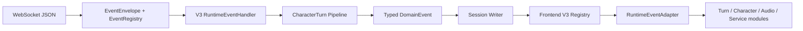

# Runtime Protocol V3

V3 是桌面端与 Companion Runtime 之间唯一的生产 WebSocket 协议。

## Envelope

每条消息必须包含：

```text
protocolVersion  eventId  eventType  sessionId  turnId
sequence         source   timestamp  payload
```

- `protocolVersion` 只能是 `3.0`。
- `eventId` 在接收端用于幂等去重。
- `sequence` 在同一 `sessionId` 内严格单调递增。
- 回合事件必须有 `turnId`；系统事件允许 `turnId: null`。
- `payload` 由 `eventType` 对应的 Pydantic/TypeScript schema 校验。
- 未知版本、未知事件、字段缺失、多余字段、乱序和 stale turn 会被明确拒绝。

## 事件清单

| 领域 | Event types |
|---|---|
| Session | `session.open`, `session.opened`, `session.closed`, `session.ping`, `session.pong` |
| Runtime | `runtime.status`, `runtime.ready`, `runtime.degraded` |
| Service | `service.status`, `configuration.updated`, `protocol.error` |
| User | `user.text`, `user.audio.started`, `user.audio.chunk`, `user.audio.completed`, `user.audio.cancelled` |
| Turn | `turn.started`, `turn.progress`, `turn.completed`, `turn.failed`, `turn.cancelled` |
| ASR | `asr.started`, `asr.result`, `asr.failed` |
| Assistant | `assistant.text.started`, `assistant.text.chunk`, `assistant.text.completed`, `assistant.failed` |
| Character | `character.intent`, `character.expression`, `character.motion`, `character.component`, `character.snapshot`, `character.suggestion`, `character.control.requested`, `character.suggestion.accepted`, `character.suggestion.rejected` |
| TTS | `tts.started`, `tts.audio`, `tts.completed`, `tts.failed`, `tts.cancelled` |
| Tool | `tool.requested`, `tool.started`, `tool.result`, `tool.failed` |
| Management | `management.requested`, `management.result`, `management.failed` |
| Telemetry | `telemetry.batch` |

`service.status.state` 的枚举覆盖 `starting`, `ready`, `degraded`, `failed`,
`stopped`，因此项目没有再增加职责重复的 `service.ready` 和
`service.failed`。

`character.state` 不存在：角色 activity 的唯一所有者是前端
`CharacterStateMachine`，Runtime 只发送 `character.intent`。这样不会重新引入
第二个可写状态源。

## 生产链路



Session Writer 是 `sessionId`、`sequence`、`eventId` 和传输时间戳的唯一生成者。
Domain 和 Pipeline 不构造 WebSocket JSON。
